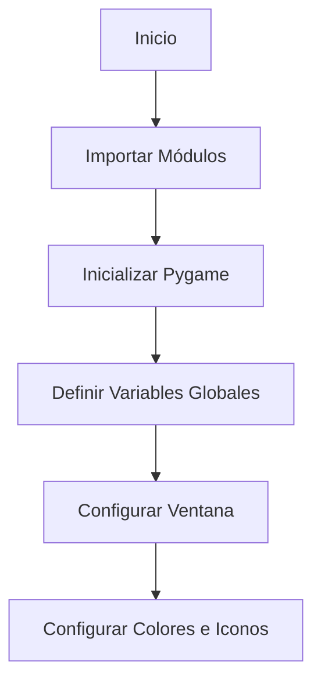

# Sopa de Letras | API-lados

API-lados es un grupo conformado por dos ingenieros civiles y un ingeniero químico que busca presentar el desarrollo y la solución de su Proyecto Final de la materia Programación de Computadores. El objetivo es explicar el programa trabajado durante el semestre 2024-1, el cual, a grandes rasgos, está inspirado en crear una aplicación que emule una **sopa de letras**, utilizando *Python*.

<p align="center">
  <a href="https://postimg.cc/rdT79scf">
    
  </a>
</p>
_______________________
1. Estructura del repositorio

sopa_de_letras/


│   ├── 01_introduccion

│   ├── 02_instalacion     Sigue estos pasos para instalar y ejecutar el proyecto.   (MICHAEL)

│   ├── 03_estructura         (CAROLINA)

│   ├── 04_funcionalidades           (ALEJANDRO)

│   ├── 05_ejemplos (video)    (MICHAEL)


2. Detalles archivos y carpetas
   
Título del proyecto
Descripción breve
Características principales
Guía de instalación rápida
Ejemplo de uso
Enlaces a documentación detallada

_______________________
# Introducción

## Sopa de Letras en Python

Este proyecto es una implementación de una Sopa de Letras en Python, creada como parte del curso de programacion de computadores dirigido por el Ingeniero Felipe Gonzales. La Sopa de Letras es un juego clásico en el que se deben encontrar palabras ocultas en una cuadrícula de letras. El objetivo principal de este proyecto es reforzar conceptos de programación aprendidos durante el curso, estructuras de datos, y algoritmos, de una manera interactiva.

## Objetivos del Proyecto

- **Código original**: programa elaborado por el grupo API_lados
- **Uso de herramientas vistas en el curso** 
- **Mejora de Habilidades**: Desarrollar habilidades en el uso de estructuras de datos, manejo de matrices y algoritmos de búsqueda.


## Funcionalidades del Programa

El programa de Sopa de Letras cuenta con las siguientes funcionalidades:

- **Generación Automática**: Crea sopas de letras de
- **Tamaño de la sopa de letras**: Matriz del tamaño de la sopa de letras (Min: 10x10, Max: 20x20), esta relacionado a la dificultad.
- **Ingreso de las palabras**: Lista de coordenadas, Strings.
- **Nivel de dificultad**: Asociado a cantidad de palabras, verticales, horizontales, diagonal. 3 niveles (Facil, Medio, dificil)

*Caracteristicas extra*:
  
- **Cuenta regresiva**
- **Sombreado o cambio visual de las palabras encontradas**
- **Interfaz grafica con estructura**
 
_______________________

# Instalacion

Sigue estos pasos para instalar y ejecutar el proyecto

## **Requisitos**
Antes de comenzar, asegúrate de tener instalado lo siguiente:

+ Python 3.8+: La última versión de Python puede descargarse desde python.org o Microsoft Store.
+ pip: El gestor de paquetes de Python, que generalmente se incluye con Python 3.8+.
+ pygame: Biblioteca para crear aplicaciones multimedia en Python

## **Instrucciones de Instalación**

1. **Descarga el Repositorio**

Puedes descargar el repositorio como un archivo ZIP desde GitHub o clonar el repositorio en tu máquina local:


**Opción 1**: Descargar ZIP

+ Ubicate en el [Repositorio](http://https://github.com/MoraMaik/Sopa_de_Letras_API-lados "Repositorio")
  
+ Haz clic en el botón "Code" y selecciona "Download ZIP".
+ Extrae el contenido del archivo ZIP en tu máquina local.

2. **Instala las Dependencias**

Instala las dependencias necesarias (pygame, sys)  usando pip:

```code
pip install pygame
```

```code
pip install sys
```

3. Asegúrate de tener las Imágenes Necesarias

Asegúrate de tener las imágenes `house-solid.png` y `stopwatch-solid.png` en el directorio raíz del proyecto. Si no las tienes, puedes descargarlas y guardarlas en el directorio del proyecto.

## Ejecucion el Programa

Una vez instaladas las dependencias, puedes ejecutar el programa de la siguiente manera:
1. Ejecutar el Programa Principal

Corre el archivo principal del proyecto para generar y visualizar la Sopa de Letras:
```code
python src/main.py
```

2. Interacción con el Programa

Al ejecutar el programa, se abrirá una ventana con el menú principal donde podrás seleccionar el nivel de dificultad: Fácil, Medio o Difícil. Utiliza el mouse para interactuar con la interfaz y seleccionar las palabras en la sopa de letras.

**Problemas Comunes y Soluciones**
+ Error al instalar dependencias: Asegúrate de que pip está actualizado ejecutando pip install --upgrade pip.
+ Imágenes no encontradas: Verifica que las imágenes `house-solid.png` y `stopwatch-solid.png` están en el directorio raíz del proyecto y que los nombres son correctos.

Con estos pasos, deberías poder instalar y ejecutar el programa de Sopa de Letras en Python sin problemas. Si encuentras algún problema, no dudes en abrir un issue en el repositorio de GitHub.

### Nota Adicional

+ Si encuentras problemas con la instalación de Pygame en diferentes sistemas operativos, consulta la [documentación oficial de Pygame](http://https://www.pygame.org/docs/ "documentación oficial de Pygame")
 para obtener instrucciones detalladas y específicas para tu sistema operativo.

_______________________
# Estructura

El código del proyecto se encuentra organizado en distintos niveles de dificultad como se mencionó anteriormente, por lo que cada uno de estos ( fácil, medio y difícil) tiene su estructura bien definida. Para poder explicarlo detalladamente, a continuación se encuentran todos los ítems que en conjunto reflejan el cuerpo de la sopa de letras.


**1. Importación de módulos y conficguración inicial**
Para este ítem importamos las bibliotecas necesarias y configuramos las variables globales que se utilizarán en todo el juego, como las dimensiones de la ventana, los colores y los iconos. A continuación un diagrama de flujo para su comprensión

A través del code se encontrarán funciones que cumplen con lo anterior de la siguiente forma:

- Importación de módulos:
```python
import pygame  # Biblioteca para gráficos y eventos
import sys     # Biblioteca para interactuar con el sistema
```
- Inicializicación de Pygame:
```python
pygame.init()  # Inicializa todos los módulos de Pygame
```
-Definición de variables globales:
```python
ANCHO = 1000  # Ancho de la ventana
ALTO = 650    # Alto de la ventana
COLOR_FONDO = (153, 197, 181)  # Color del fondo
COLOR_BOTONES = (230, 230, 230)  # Color de los botones
```

**2. Creación de la ventana de juego**
En esta sección nos encargamos de  configurar la ventana principal del juego y establecer los iconos y el título que aparecerán en la interfaz. Esta ventana será el espacio donde el jugador interactuará.

```mermaid
graph TD
  A[main()] --> B[Crear Ventana]
  B --> C[Establecer Título de la Ventana]
  C --> D[Configurar Iconos]
```
Las funciones se pueden encontrar a través del code cómo: 
- Crear la ventana:
```python
ventana = pygame.display.set_mode((ANCHO, ALTO))  # Crea la ventana del juego
```
- Establecer título de la ventana: 
```python
ventana = pygame.display.set_mode((ANCHO, ALTO))  # Crea la ventana del juego
```
-Configurar íconos:
```python
icono = pygame.image.load('house-solid.png')  # Carga la imagen del icono
icono = pygame.transform.scale(icono, (30, 30))  # Escala el icono
```

**3. Función principal `main()`**
La función main() es el punto de entrada del juego. Aquí se muestra el menú principal, donde el jugador puede seleccionar el nivel de dificultad. También maneja los eventos de usuario, como clics del mouse, que determinan la navegación hacia las funciones correspondientes de cada nivel.

```mermaid
graph TD
  A[main()] --> B[Mostrar Menú Principal]
  B --> C[Detectar Eventos]
  C -->|Click en Fácil| D[facil()]
  C -->|Click en Medio| E[medio()]
  C -->|Click en Difícil| F[dificil()]
```
Ejemplos: 
- Definir la función principal:
```python
def main():
    ventana = pygame.display.set_mode((ANCHO, ALTO))  # Crear la ventana
```
- Dibujar botones y título:
```python
rect_facil = pygame.Rect((ANCHO // 2 - 100), 200, 200, 50)  # Botón fácil
rect_medio = pygame.Rect((ANCHO // 2 - 100), 290, 200, 50)  # Botón medio
rect_dificil = pygame.Rect((ANCHO // 2 - 100), 380, 200, 50)  # Botón difícil
```
- Manejo de eventos:
```python
for evento in pygame.event.get():
    if evento.type == pygame.QUIT:
        pygame.quit()
        sys.exit()
    elif evento.type == pygame.MOUSEBUTTONDOWN:
        if rect_facil.collidepoint(evento.pos):
            facil()
        if rect_medio.collidepoint(evento.pos):
            medio()
        if rect_dificil.collidepoint(evento.pos):
            dificil()
```
- Actualizar pantalla:
```python
pygame.display.flip()  # Actualizar la pantalla
```

**4. Funciones de dificultad: `facil()`, `medio()`, `dificil()`**
Cada una de estas funciones se encarga de un nivel específico de dificultad. Aquí se define la matriz de letras para la sopa de letras y se gestiona la interacción del jugador, como seleccionar letras en la matriz y verificar si forman una palabra válida.

```mermaid
graph TD
  A[facil()/medio()/dificil()] --> B[Inicializar Diccionario de Palabras]
  B --> C[Inicializar Matriz de Letras]
  C --> D[Iniciar Loop Principal]
  D --> E[Capturar Eventos de Usuario]
  E -->|Mouse Down| F[inicial_pos()]
  E -->|Mouse Up| G[final_pos()]
  G --> H[obtener_palabra_seleccionada()]
  H -->|Palabra Encontrada| I[Actualizar Estado]
  D --> J[Actualizar Pantalla]
```
Las funciones utilizadas se pueden encontrar de la siguiente forma:
- Inicializar diccionario de palabras:
```python
palabras = {"TENIS": False, "PADEL": False, ...}  # Palabras en modo fácil
```
- Definir la matriz de letras:
```python
matriz = [
    ["B","A","S","K","E","T","B","A","L","L"],
    ...
]
```
- Manejo de eventos:
```python
for evento in pygame.event.get():
    if evento.type == pygame.QUIT:
        pygame.quit()
        sys.exit()
    if evento.type == pygame.MOUSEBUTTONDOWN:
        pos_inicial = inicial_pos(pygame.mouse.get_pos())
    if evento.type == pygame.MOUSEBUTTONUP:
        pos_final = final_pos(pygame.mouse.get_pos())
        obtener_palabra_seleccionada(pos_inicial, pos_final, matriz, palabras, encontradas)
        pos_inicial = None
```
- Actualizar pantalla:
```python
pygame.display.flip()  # Actualizar la pantalla
```

**5. Funciones auxiliares:**
Las funciones auxiliares ayudan a manejar la lógica de la selección de letras en la matriz. Determinan las posiciones inicial y final del mouse, calculan las direcciones de selección y verifican si las letras seleccionadas forman una palabra válida.

```mermaid
graph TD
  A[inicial_pos()] --> B[Detectar Posición Inicial]
  B --> C[Esperar Posición Final]
  C --> D[final_pos()]
  D --> E[Determinar Dirección de la Selección]
  E --> F[obtener_palabra_seleccionada()]
  F -->|Palabra Válida| G[Actualizar Diccionario]
  G --> H[Marcar Palabra como Encontrada]
```
Ejemplos:
- Determinar posición inicial:
```python
def inicial_pos(inicial):
    x1, y1 = inicial
    pos_matriz_inicial = ((x1 - (ANCHO // 2 - 300)) // 60, (y1 - 20) // 60)
    return pos_matriz_inicial
```
- Determinar posición final:
```python
def final_pos(final):
    x2, y2 = final
    pos_matriz_final = ((x2 - (ANCHO // 2 - 300)) // 60, (y2 - 20) // 60)
    return pos_matriz_final
```
- Verificar palabra seleccionada:
```python
def obtener_palabra_seleccionada(inicial, final, matriz, palabras, encontradas):
    x1, y1 = inicial
    x2, y2 = final
    palabra = ""
    if x1 == x2:
        for i in range (y1, y2 + 1):
            palabra += matriz[i][x1]
    if palabra in palabras:
        palabras[palabra] = True
        encontradas.append((inicial, final))
```

**7. Ciclo de juego y actualización de pantalla:**
El ciclo de juego es crucial para mantener el juego en funcionamiento. Captura los eventos, actualiza la interfaz y refresca la pantalla continuamente para reflejar cualquier cambio en la matriz de letras y el estado de las palabras encontradas.
 
```mermaid
graph TD
  A[Loop Principal] --> B[Captura de Eventos]
  B --> C[Actualizar Matriz de Letras]
  C --> D[Mostrar Estado del Juego]
  D --> E[pygame.display.flip()]
  E --> A
```
Ejemplos: 
- Bucle Principal:
```python
while True:
    for evento in pygame.event.get():
        if evento.type == pygame.QUIT:
            pygame.quit()
            sys.exit()
```
- Actualizar pantalla:
```python
pygame.display.flip()  # Refresca la pantalla
```

**8. Finalización juego:**
Cuando el jugador decide salir del juego, es importante que el programa se cierre correctamente, liberando todos los recursos utilizados. Esto se logra mediante la función `pygame.quit()` seguida de `sys.exit()`, que asegura una salida limpia del programa.
```mermaid
graph TD
  A[Usuario Decide Salir] --> B[pygame.quit()]
  B --> C[sys.exit()]
```
Ejemplos:
- Cerrar pygame:
```python
pygame.quit()  # Cierra Pygame
```
-Salir del programa
```python
sys.exit()  # Sale del programa
```
*DIAGRAMA GENERAL DEL JUEGO*
```mermaid
graph TD
  A[Inicio del Juego] --> B[main()]
  B --> C{Seleccionar Dificultad}
  C -->|Fácil| D[facil()]
  C -->|Medio| E[medio()]
  C -->|Difícil| F[dificil()]
  D --> G[Loop de Juego Fácil]
  E --> H[Loop de Juego Medio]
  F --> I[Loop de Juego Difícil]
  G --> J[Verificar Palabras]
  H --> J
  I --> J
  J --> K{Todas las Palabras Encontradas?}
  K -->|Sí| L[Volver al Menú]
  K -->|No| M[Continuar Bucle]
  L --> B
```


**1. Importaciones**

``` python
import pygame
import sys
```

Decidimos utilizar Pygame, la cual se carcateriza por ser una biblioteca que permite la realización de juegos en python, proporcionando funcionalidades como lo son gráficos y manejo de eventos.

- Inicialización:
``` python
pygame.init()
```

- Creación de la ventana:
``` python
ventana = pygame.display.set_mode((ANCHO, ALTO))
pygame.display.set_caption("Sopa de letras")
```

- Carga de imágenes:
``` python
icono = pygame.image.load('house-solid.png')
icono = pygame.transform.scale(icono, (30, 30))
```

- Manejo de eventos:
``` python
for evento in pygame.event.get():
    if evento.type == pygame.QUIT:
        pygame.quit()
        sys.exit()
```

- Dibujo de la pantalla:
``` python
ventana.fill(COLOR_FONDO)
pygame.draw.rect(ventana, COLOR_BOTONES, rect_facil, border_radius=10)
ventana.blit(texto, (ANCHO // 2 - texto.get_width() // 2, 225 - texto.get_height() // 2))
```
  
- Actualizar en pantalla:
``` python
pygame.display.flip()
```

En cuánto a sys que se caracteriza por brindar herramientas para poder interactuar con pyhton se utilizó exclusivamente para asegurar que el programa se cierre adecuadamente cuando el usuario quiera salir de este y presione "X".

- Salir del programa:
``` python
sys.exit()
``` 


``` mermaid
``` 


