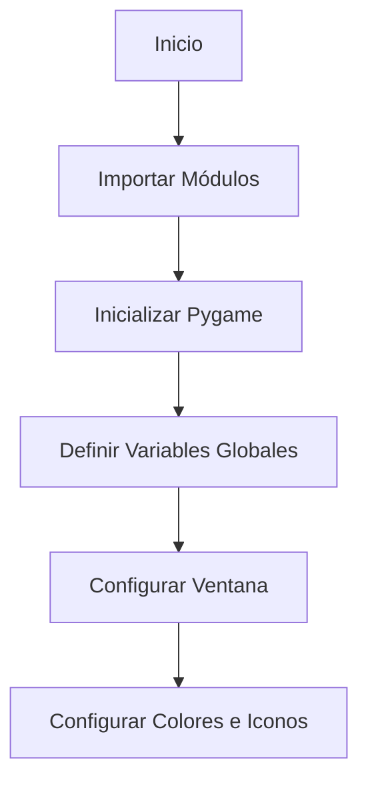
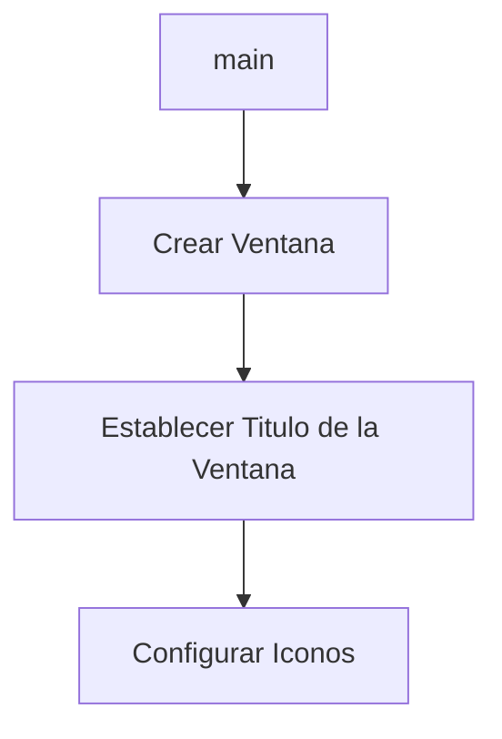
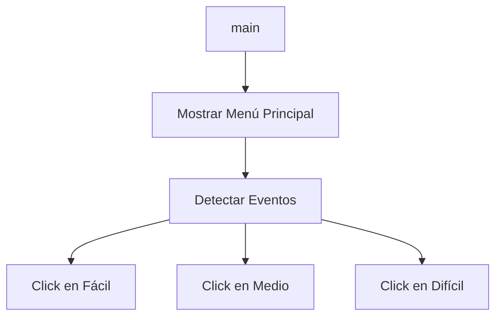
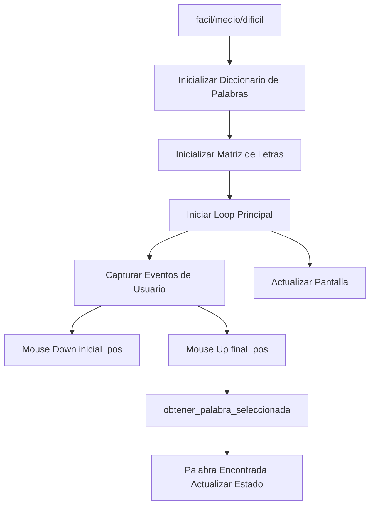
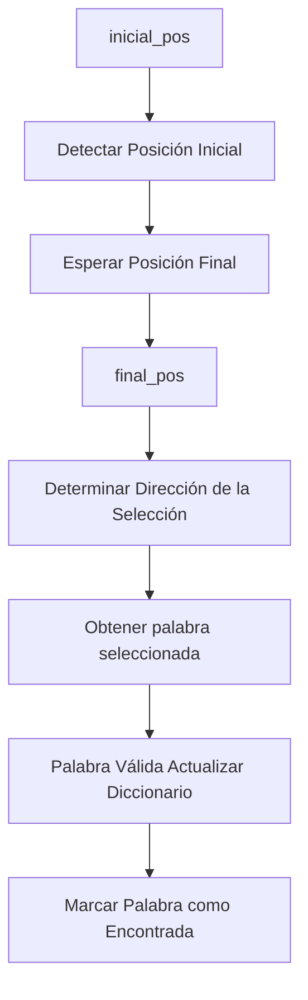
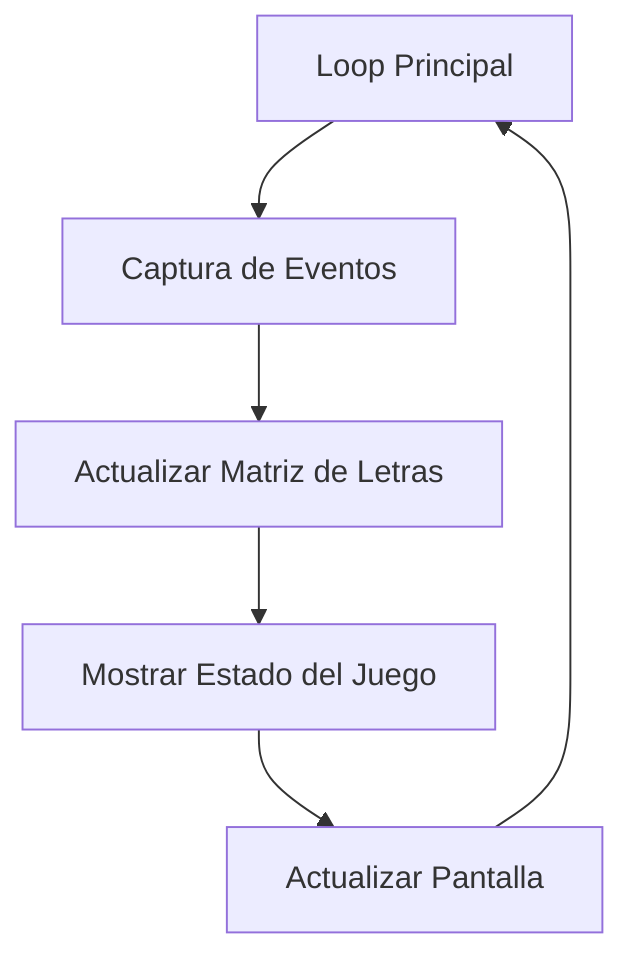
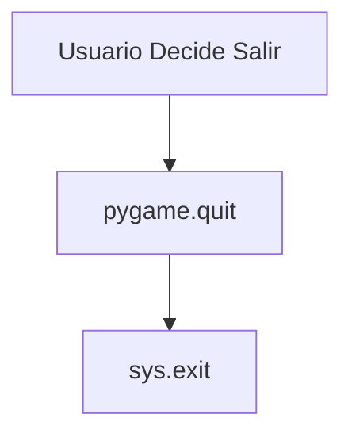
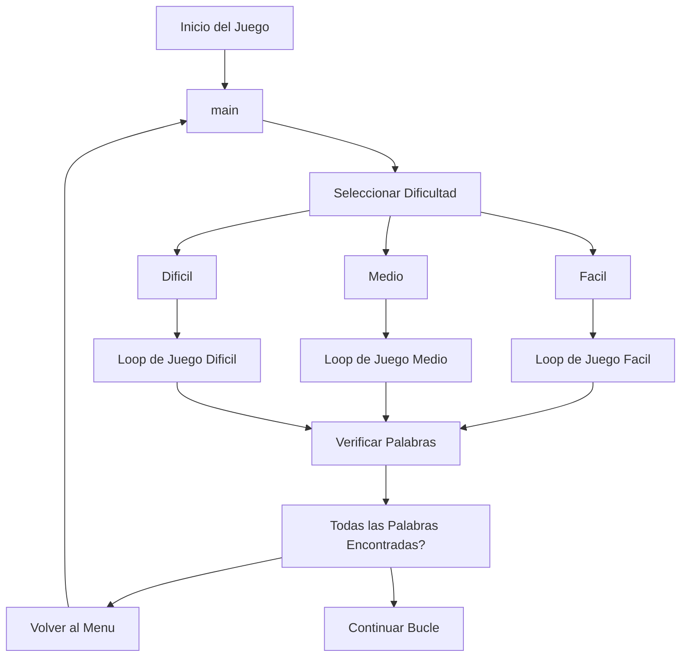

# Sopa de Letras | API-lados

API-lados es un grupo conformado por dos ingenieros civiles y un ingeniero químico que busca presentar el desarrollo y la solución de su Proyecto Final de la materia Programación de Computadores. El objetivo es explicar el programa trabajado durante el semestre 2024-1, el cual, a grandes rasgos, está inspirado en crear una aplicación que emule una **sopa de letras**, utilizando *Python*.

Documento de Identidad  | Nombres y Apellidos  | Carrera 
------------- | -------------| -------------
1052837889 | Angie Carolina Salazar Lara | Ing. Civil
1086774311 | Michael Kaleth Mora Mejia | Ing. Civil
1000364014 | Alejandro Urrego Valencia | Ing. QuÍmica

<p align="center">
  <a href="https://postimg.cc/rdT79scf">
    
  </a>
</p>

_______________________
# Introducción

Este proyecto es una implementación de una Sopa de Letras en Python, creada como parte del curso de programacion de computadores dirigido por el Ingeniero Felipe Gonzales. La Sopa de Letras es un juego clásico en el que se deben encontrar palabras ocultas en una cuadrícula de letras. El objetivo principal de este proyecto es reforzar conceptos de programación aprendidos durante el curso, estructuras de datos, y algoritmos, de una manera interactiva.

## Definicion de Alternativa

La alternativa de "Sopa de letras" presentada se puede definir como un juego interactivo digital donde el jugador busca palabras escondidas en una cuadrícula de letras. Utilizando **Pygame** como motor de gráficos, esta implementación permite elegir entre tres niveles de dificultad, interactuar mediante clics del ratón y seleccionar palabras directamente en la cuadrícula.

### Definición:

1. Interfaz gráfica mediante Pygame:

+ La alternativa utiliza **Pygame** para generar la ventana de juego, gestionar eventos como clics y entradas del ratón, y representar gráficamente tanto las letras de la cuadrícula como los botones de selección de nivel. Siendo Pygame el mas adecuado gracias a la simplicidad para gestionar gráficos en 2D y eventos de usuario.

2. Generación aleatoria de matrices de letras:

+ El programa genera dinámicamente una matriz de letras aleatorias en la cuadrícula del juego, asegurando que las palabras ocultas se distribuyan de manera estratégica en diferentes direcciones. Los espacios restantes se llenan con letras generadas aleatoriamente, manteniendo una distribución equilibrada y evitando patrones predecibles. Esta aleatorización añade variabilidad a cada partida, haciendo que el juego sea único cada vez que se inicia, y evitando que los jugadores memoricen las soluciones.

3. Niveles de dificultad ajustables:

+ Se ofrecen tres niveles de dificultad: fácil, medio, y difícil, cada uno con una cuadrícula de tamaño diferente y con una lista de palabras escondidas acorde a la dificultad. La variación de dificultad se logra cambiando el tamaño de la cuadrícula y el número de palabras a encontrar.

4. Interacción mediante clics y arrastre:

+ El usuario selecciona palabras al hacer clic y arrastrar el ratón sobre las letras de la cuadrícula. Este tipo de interacción simula el proceso de selección manual de palabras en un juego de sopa de letras tradicional.

5. Juego basado en listas de palabras temáticas:

+ En cada nivel, las palabras a encontrar pertenecen a un tema determinado. Por ejemplo, el nivel fácil incluye palabras relacionadas con deportes, el nivel medio incluye artistas y escritores, y el nivel difícil incluye nombres de ciudades.

6. Opciones visuales y estilísticas:

+ La cuadrícula de letras se resalta visualmente cuando el usuario selecciona palabras, y los botones de nivel están diseñados con rectángulos y texto estilizado usando fuentes personalizadas, lo que mejora la experiencia visual.

7. Funcionalidad de cronómetro en el nivel -difícil- :
   
+ Un temporizador limita el tiempo para encontrar todas las palabras en el nivel más difícil, añadiendo un elemento de desafío adicional. Esto simula una presión similar a los juegos tradicionales de sopa de letras cronometrados.


## Objetivos del Proyecto

- **Código original**: programa elaborado por el grupo API_lados
- **Uso de herramientas vistas en el curso** 
- **Mejora de Habilidades**: Desarrollar habilidades en el uso de estructuras de datos, manejo de matrices y algoritmos de búsqueda.


## Funcionalidades del Programa

El programa de Sopa de Letras cuenta con las siguientes funcionalidades:

- **Generación Automática**:  Crea sopas de letras de manera aleatoria, colocando palabras en posiciones horizontales, verticales y diagonales en diversas direcciones.
- **Tamaño de la sopa de letras**: Matriz del tamaño de la sopa de letras (Min: 10x10, Max: 20x20), esta relacionado a la dificultad.
- **Ingreso de las palabras**: Lista de coordenadas, Strings.
- **Nivel de dificultad**: Asociado a cantidad de palabras, verticales, horizontales, diagonal. 3 niveles (Facil, Medio, dificil)

*Caracteristicas extra*:
  
- **Cuenta regresiva**
- **Sombreado o cambio visual de las palabras encontradas**
- **Interfaz grafica con estructura**
 
_______________________

# Instalación

Sigue estos pasos para instalar y ejecutar el proyecto

## **Requisitos**
Antes de comenzar, asegúrate de tener instalado lo siguiente:

+ Python 3.8+: La última versión de Python puede descargarse desde python.org o Microsoft Store.
+ pip: El gestor de paquetes de Python, que generalmente se incluye con Python 3.8+.
+ pygame: Biblioteca para crear aplicaciones multimedia en Python

## **Instrucciones de Instalación**

1. **Descarga el Repositorio**

Puedes descargar el repositorio como un archivo ZIP desde GitHub o clonar el repositorio en tu máquina local:


**Opción 1**: Descargar ZIP

+ Ubicate en el [Repositorio]([http://localhost/](https://github.com/MoraMaik/Sopa_de_Letras_API-lados)) 
+ Haz clic en el botón "Code" y selecciona "Download ZIP".
+ Extrae el contenido del archivo ZIP en tu máquina local.

2. **Instala las Dependencias**

Instala las dependencias necesarias (pygame, sys)  usando pip:

```code
pip install pygame
```

```code
pip install sys
```

3. Asegúrate de tener las Imágenes Necesarias

Asegúrate de tener las imágenes `house-solid.png` y `stopwatch-solid.png` en el directorio raíz del proyecto. Si no las tienes, puedes descargarlas y guardarlas en el directorio del proyecto.

## Ejecución del Programa

Una vez instaladas las dependencias, puedes ejecutar el programa de la siguiente manera:
1. Ejecutar el Programa Principal

Corre el archivo principal del proyecto para generar y visualizar la Sopa de Letras:
```code
python src/main.py
```

2. Interacción con el Programa

Al ejecutar el programa, se abrirá una ventana con el menú principal donde podrás seleccionar el nivel de dificultad: Fácil, Medio o Difícil. Utiliza el mouse para interactuar con la interfaz y seleccionar las palabras en la sopa de letras.

**Problemas Comunes y Soluciones**
+ Error al instalar dependencias: Asegúrate de que pip está actualizado ejecutando pip install --upgrade pip.
+ Imágenes no encontradas: Verifica que las imágenes `house-solid.png` y `stopwatch-solid.png` están en el directorio raíz del proyecto y que los nombres son correctos.

Con estos pasos, deberías poder instalar y ejecutar el programa de Sopa de Letras en Python sin problemas. Si encuentras algún problema, no dudes en abrir un issue en el repositorio de GitHub.

### Nota Adicional

+ Si encuentras problemas con la instalación de Pygame en diferentes sistemas operativos, consulta la [documentación oficial de Pygame](http://https://www.pygame.org/docs/ "documentación oficial de Pygame")
 para obtener instrucciones detalladas y específicas para tu sistema operativo.

## Video tutorial


https://github.com/user-attachments/assets/6521f5ae-832c-407b-a552-15b942868f47


_______________________
# Estructura

El código del proyecto se encuentra organizado en distintos niveles de dificultad como se mencionó anteriormente, por lo que cada uno de estos ( fácil, medio y difícil) tiene su estructura bien definida. Para poder explicarlo detalladamente, a continuación se encuentran todos los ítems que en conjunto reflejan el cuerpo de la sopa de letras.


**1. Importación de módulos y configuración inicial**

Para este ítem importamos las bibliotecas necesarias y configuramos las variables globales que se utilizarán en todo el juego, como las dimensiones de la ventana, los colores y los iconos. A continuación un diagrama de flujo para su comprensión

Ejemplos:

- Importación de módulos:
```python
import pygame  # Biblioteca para gráficos y eventos
import sys     # Biblioteca para interactuar con el sistema
```
- Inicializicación de Pygame:
```python
pygame.init()  # Inicializa todos los módulos de Pygame
```
-Definición de variables globales:
```python
ANCHO = 1000  # Ancho de la ventana
ALTO = 650    # Alto de la ventana
COLOR_FONDO = (153, 197, 181)  # Color del fondo
COLOR_BOTONES = (230, 230, 230)  # Color de los botones
```

**2. Creación de la ventana de juego**

En esta sección nos encargamos de  configurar la ventana principal del juego y establecer los iconos y el título que aparecerán en la interfaz. Esta ventana será el espacio donde el jugador interactuará.




Ejemplos: 
- Crear la ventana:
```python
ventana = pygame.display.set_mode((ANCHO, ALTO))  # Crea la ventana del juego
```
- Establecer título de la ventana: 
```python
ventana = pygame.display.set_mode((ANCHO, ALTO))  # Crea la ventana del juego
```
-Configurar íconos:
```python
icono = pygame.image.load('house-solid.png')  # Carga la imagen del icono
icono = pygame.transform.scale(icono, (30, 30))  # Escala el icono
```

**3. Función principal `main()`**

La función main() es el punto de entrada del juego. Aquí se muestra el menú principal, donde el jugador puede seleccionar el nivel de dificultad. También maneja los eventos de usuario, como clics del mouse, que determinan la navegación hacia las funciones correspondientes de cada nivel.


Ejemplos: 
- Definir la función principal:
```python
def main():
    ventana = pygame.display.set_mode((ANCHO, ALTO))  # Crear la ventana
```
- Dibujar botones y título:
```python
rect_facil = pygame.Rect((ANCHO // 2 - 100), 200, 200, 50)  # Botón fácil
rect_medio = pygame.Rect((ANCHO // 2 - 100), 290, 200, 50)  # Botón medio
rect_dificil = pygame.Rect((ANCHO // 2 - 100), 380, 200, 50)  # Botón difícil
```
- Manejo de eventos:
```python
for evento in pygame.event.get():
    if evento.type == pygame.QUIT:
        pygame.quit()
        sys.exit()
    elif evento.type == pygame.MOUSEBUTTONDOWN:
        if rect_facil.collidepoint(evento.pos):
            facil()
        if rect_medio.collidepoint(evento.pos):
            medio()
        if rect_dificil.collidepoint(evento.pos):
            dificil()
```
- Actualizar pantalla:
```python
pygame.display.flip()  # Actualizar la pantalla
```

**4. Funciones de dificultad: `facil()`, `medio()`, `dificil()`**

Cada una de estas funciones se encarga de un nivel específico de dificultad. Aquí se define la matriz de letras para la sopa de letras y se gestiona la interacción del jugador, como seleccionar letras en la matriz y verificar si forman una palabra válida.


Ejemplos:
- Inicializar diccionario de palabras:
```python
palabras = {"TENIS": False, "PADEL": False, ...}  # Palabras en modo fácil
```
- Definir la matriz de letras:
```python
matriz = [
    ["B","A","S","K","E","T","B","A","L","L"],
    ...
]
```
- Manejo de eventos:
```python
for evento in pygame.event.get():
    if evento.type == pygame.QUIT:
        pygame.quit()
        sys.exit()
    if evento.type == pygame.MOUSEBUTTONDOWN:
        pos_inicial = inicial_pos(pygame.mouse.get_pos())
    if evento.type == pygame.MOUSEBUTTONUP:
        pos_final = final_pos(pygame.mouse.get_pos())
        obtener_palabra_seleccionada(pos_inicial, pos_final, matriz, palabras, encontradas)
        pos_inicial = None
```
- Actualizar pantalla:
```python
pygame.display.flip()  # Actualizar la pantalla
```

**5. Funciones auxiliares:**

Las funciones auxiliares ayudan a manejar la lógica de la selección de letras en la matriz. Determinan las posiciones inicial y final del mouse, calculan las direcciones de selección y verifican si las letras seleccionadas forman una palabra válida.


Ejemplos:
- Determinar posición inicial:
```python
def inicial_pos(inicial):
    x1, y1 = inicial
    pos_matriz_inicial = ((x1 - (ANCHO // 2 - 300)) // 60, (y1 - 20) // 60)
    return pos_matriz_inicial
```
- Determinar posición final:
```python
def final_pos(final):
    x2, y2 = final
    pos_matriz_final = ((x2 - (ANCHO // 2 - 300)) // 60, (y2 - 20) // 60)
    return pos_matriz_final
```
- Verificar palabra seleccionada:
```python
def obtener_palabra_seleccionada(inicial, final, matriz, palabras, encontradas):
    x1, y1 = inicial
    x2, y2 = final
    palabra = ""
    if x1 == x2:
        for i in range (y1, y2 + 1):
            palabra += matriz[i][x1]
    if palabra in palabras:
        palabras[palabra] = True
        encontradas.append((inicial, final))
```

**6. Ciclo de juego y actualización de pantalla:**

El ciclo de juego es crucial para mantener el juego en funcionamiento. Captura los eventos, actualiza la interfaz y refresca la pantalla continuamente para reflejar cualquier cambio en la matriz de letras y el estado de las palabras encontradas.
 

Ejemplos: 
- Bucle Principal:
```python
while True:
    for evento in pygame.event.get():
        if evento.type == pygame.QUIT:
            pygame.quit()
            sys.exit()
```
- Actualizar pantalla:
```python
pygame.display.flip()  # Refresca la pantalla
```

**7. Finalización juego:**

Cuando el jugador decide salir del juego, es importante que el programa se cierre correctamente, liberando todos los recursos utilizados. Esto se logra mediante la función `pygame.quit()` seguida de `sys.exit()`, que asegura una salida limpia del programa.

Ejemplos:
- Cerrar pygame:
```python
pygame.quit()  # Cierra Pygame
```
-Salir del programa
```python
sys.exit()  # Sale del programa
```
*DIAGRAMA GENERAL DEL JUEGO*

Para concluir con la estructura tenemos su diagrama general, el cual reúne todos los ítems anteriormente explicados:

_______________________
# Funcionalidades:

## Pygame y sus ventajas

Pygame es una biblioteca de Python utilizada en varios sistemas operativos la cual sirve para crear videojuegos en 2D. Ofrece una variedad de funcionalidades las cuales aprovechamos para el desarrollo de la sopa de letras, las cuales son:

1. Gestión de gráficos: Pygame permite cargar y mostrar imágenes, dibujar formas y textos en la pantalla.

```python
rect = pygame.Rect(ANCHO // 2 = 300, 20, 600, 600)

pygame.draw.circle(temp_surface, (255, 0, 0, 128), (x1 * 60 + 30, y1 * 60 + 30), 14)

```


2. Entrada del usuario: Pygame permite detectar eventos de teclado y mouse, como presiones de teclas y clics.

```python
for evento in pygame.event.get():
    if evento.type == pygame.QUIT:
        pygame.quit()
        sys.exit()
    elif evento.type == pygame.MOUSEBUTTONDOWN:
        if rect_facil.collidepoint(evento.pos):
            facil()
        if rect_medio.collidepoint(evento.pos):
            medio()
        if rect_dificil.collidepoint(evento.pos):
            dificil()
```


3. Gestión de ventanas: Pygame permite crear y manipular ventanas para mostrar el juego.

```python
def main():
    ventana = pygame.display.set_mode((ANCHO, ALTO))  # Crear la ventana
```

4. Gestión de tiempo: Pygame ofrece funciones para controlar y medir el tiempo en el juego, como medir el tiempo transcurrido o crear temporizadores.

```python
 start_time = 60
    start_ticks = pygame.time.get_ticks()
```


_______________________
# Ejemplo de Interración 

https://github.com/user-attachments/assets/e5cd5412-511e-4d33-8b36-33d1aeb636ba


